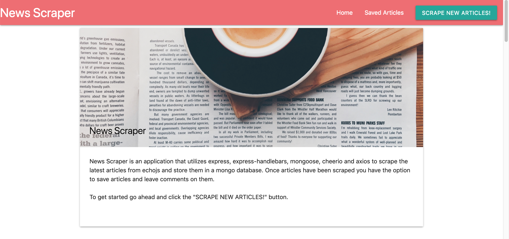

# News-Scraper

[Deployed Site](https://sheltered-gorge-46172.herokuapp.com/)

### Overview

* Scrape the latest Articles from echojs.

* Articles will be stored in a mongo database.

* If you like an article you can add it to the saved collection.

* Once an article is in the saved collection, you can add comments about the article.

* Comments can be removed and Articles can also be removed from the saved collection.

## Installation

To install the application follow the instructions below:

	git clone https://github.com/Bgosse1/News-Scraper.git
	cd News-Scraper
	npm install

Make sure you have mongo setup in your local enviornment before running.

## Running Locally

To run the application locally and access it in your browser, run

	npm run start

The application will now be running locally on port 3000. You can then access it locally from your browser at the URL `localhost:3000`.